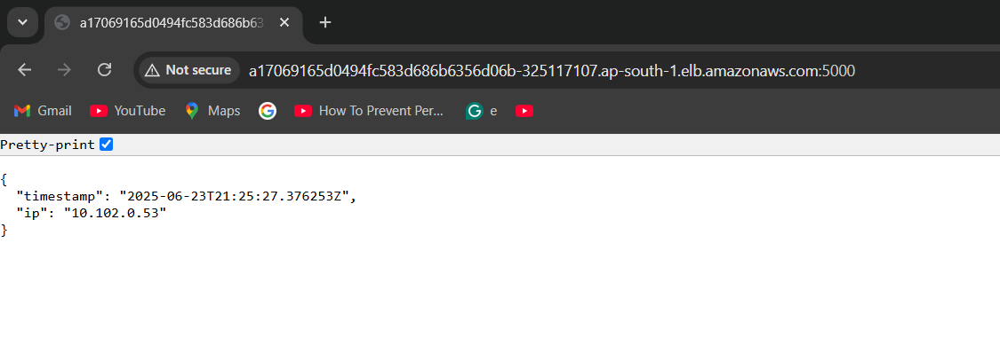

# 🚀 Full Stack AWS Infrastructure Deployment with Terraform and Docker

This project demonstrates how to provision AWS infrastructure using **Terraform** and deploy a containerized application using **Amazon EKS (Elastic Kubernetes Service)**. It includes:

- A custom **Virtual Private Cloud (VPC)**
- A production-ready **EKS cluster**
- A containerized application `simple-time-service` deployed to the cluster
- A public-facing **LoadBalancer** service accessible via browser on port `5000`

---

## 📌 Purpose

This project is built to show end-to-end Infrastructure as Code (IaC) on AWS using Terraform. It will:

- Provision secure, scalable infrastructure
- Deploy Kubernetes workloads on EKS
- Follow modular and reusable Terraform practices

---

## 🧰 Prerequisites

Before you begin, make sure you have the following tools installed and configured:

| Tool | Description |
|------|-------------|
| **Terraform (≥ 1.3)** | Infrastructure provisioning |
| **AWS CLI** | Configured with IAM permissions to manage EKS, VPC, EC2, IAM |
| **kubectl** | To interact with the deployed EKS cluster |
| **Docker** | To build the application image (optional) |

You must also ensure that your AWS credentials are configured using `aws configure` or through environment variables.

---

## 📁 Folder Structure

.
├── app/ # App source code & Dockerfile
│ └── Dockerfile
│ └── requirements.txt
│ └── simple_time_service.py
├── terraform/ # Terraform IaC files
│ └── environment/
│   └── prod/
│     └── backend-prod.conf
│     └── backend.tf
│     └── data.tf
│     └── main.tf
│     └── output.tf
│     └── provider.tf
│     └── terraform.tfvars
│     └── variables.tf
│     └── versions.tf
│ └── modules/
│   └── eks/
│   └── vpc/
│   └── simple-time-service-deployment/
│ └── tf-state-lock-infra/
└── README.md # ✅ Project documentation
└── screenshots/


## 🧱 Terraform Module Breakdown

### 🔹 VPC Module (`modules/vpc`)
Creates:
- A custom VPC
- Two Public and two private subnets
- Internet Gateway and NAT Gateway

### 🔹 EKS Module (`modules/eks`)
Creates:
- EKS Cluster
- Managed Node Groups
- IAM roles and security groups

### 🔹 App Module (`modules/simple-time-service-deployment`)
Deploys:
- A Kubernetes Deployment for the `simple-time-service`
- A Kubernetes Service of type `LoadBalancer`


## 🚀 Step-by-Step Deployment

### 1️⃣ Clone the Repository

```bash
git clone https://github.com/kratikagupta21/simple-time-service.git
cd simple-time-service

### 2️⃣ Build & Push Docker Image

cd app
docker build -t simple-time-service:latest .
docker push simple-time-service:latest

### 3️⃣ Deploy with Terraform

cd terraform
cd environment/prod/
terraform init -backend-config="backend-prod.conf"
terraform plan
terraform apply

### 4️⃣ Access the Application 
After deployment completes, you will get an output called load_balancer_url

Access the service in your browser:

http://<load_balancer_dns>:5000

### 5️⃣ Deployment Output

#### ✅ App Output


🧹 Cleanup
To destroy all AWS resources :

cd terraform/environment/prod/
terraform destroy